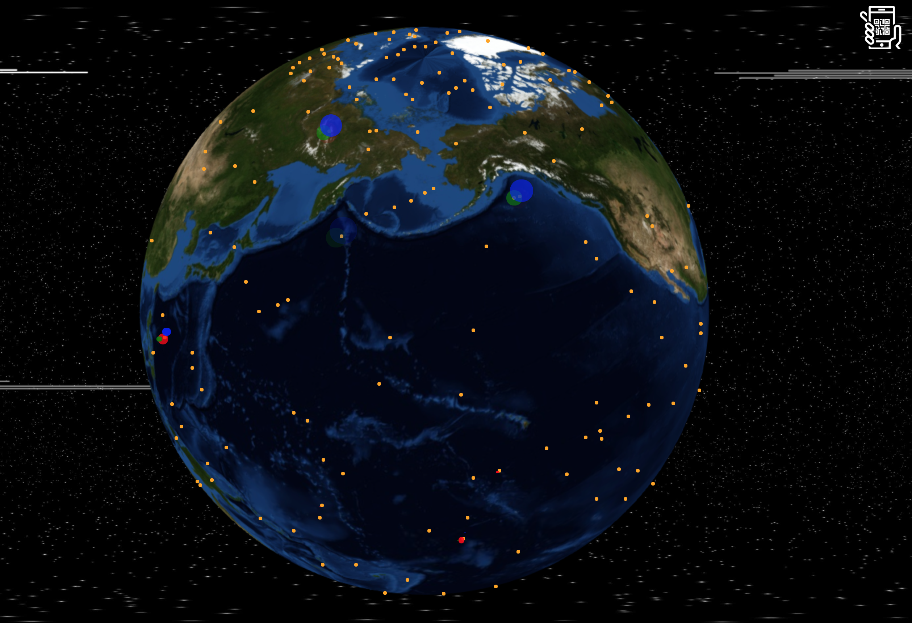

# Happy new year
This application use http://www.webglearth.com/ to create fireworks on a globe controlled by a mobile phone.

## Generating maps squares
```app/crop/index.php``` generate map squares from one big image

### Downloading map squares
```app/download/index.php``` download all map squares for geting zoom from http://otile3.mqcdn.com

### Make big map from squares
```/app/merge/index.php``` create a big map from small squares for geting zoom

### Synchronisation mobile and desktop browser
```app/synchro/index.php``` useful for controling desktop browser by mobile


